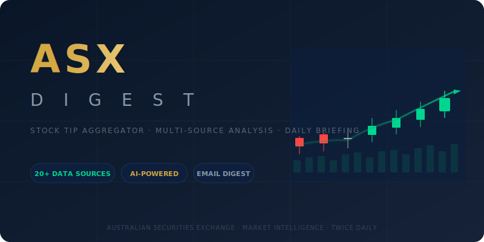

<p align="center">
  
</p>

<p align="center">
  <strong>Multi-source ASX stock tip aggregator with AI-powered analysis and conviction scoring.</strong><br>
  Fetches 20+ data sources, extracts stock picks via Claude, emails a twice-daily tiered digest.
</p>

<p align="center">
  
  
  
  
</p>

---

## 📊 What It Does

ASX Digest monitors the Australian stock market across multiple dimensions and delivers a structured email briefing twice daily (morning and evening). Each run:

1. **Fetches** latest content from 20+ sources (analyst feeds, Reddit, YouTube, news, regulatory data)
2. **Enriches** YouTube items with full transcripts
3. **Analyzes** each item via Claude Haiku to extract stock picks, catalysts, risks, and price targets
4. **Aggregates** picks by ticker, tracks historical mentions across runs
5. **Scores conviction** — stocks appearing across multiple *source types* (analyst + retail, etc.) flagged as 🔥 **HIGH CONVICTION**
6. **Runs market intelligence** — sector performance, commodity prices, sentiment analysis
7. **Emails** a formatted HTML digest with tiered picks, market context, and sector signals

> **No picks = no email.** You only get a briefing when there's something worth reading.

---

## 📬 Sample Output

```
ASX Morning Briefing — Mon 05 May 2026
========================================

📋 TODAY'S MARKET OUTLOOK
ASX futures flat; commodity strength in copper (+1.2%) supports materials
sector. Watch financials ahead of RBA minutes.
Overall sentiment: Neutral with bullish commodities tilt

────────────────────────────────────────────────────
🔥 HIGH CONVICTION (2+ sources or multi-day correlation)

  DYL (Deep Yellow) — BUY
  📊 Analyst + Retail agree across multiple days
  Sources: Stocks Down Under, r/ASX (plus Stockhead from prior runs)
  Thesis: Uranium play benefiting from energy transition policy momentum
  🎯 $1.65

────────────────────────────────────────────────────
📌 SINGLE SOURCE PICKS

  BHP (BHP Group) — BUY
  Source: Motley Fool Australia
  Thesis: Copper exposure and dividend yield attractive at current levels
```

---

## 🔌 Data Sources

### Professional Analyst Feeds (RSS)
| Source | Type | Update Frequency |
|--------|------|-----------------|
| Stocks Down Under | Fundamental analysis | Daily |
| Stockhead | ASX small/mid-cap coverage | Daily |
| The Market Herald | Market news & tips | Daily |
| ShareCafe | Investor insights | Daily |
| Motley Fool Australia | Long-term buy recommendations | Daily |
| The Bull 18 Share Tips | 3 analysts × 6 picks (18 broker ratings) | Weekly (Mon) |

### YouTube Financial Channels (RSS + Transcript Enrichment)
| Source | Focus |
|--------|-------|
| Wealth Within | Technical analysis & trading |
| Livewire Markets | Fund manager interviews |
| Rask | Investor education & stock deep dives |
| Finer Market Points | Technical & macro analysis |
| Australian Stock Report | Trading ideas & market wraps |
| CommSecTV | Broker research & market updates |

### Social & Retail Sentiment
| Source | Type | Access |
|--------|------|--------|
| r/ASX_Bets | Retail trading sentiment | Reddit JSON API |
| r/AusFinance | Retail investor discussion | Reddit JSON API |
| r/ASX | General ASX discussion | Reddit JSON API |
| r/ausstocks | Stock-specific discussion | Reddit JSON API |

### Regulatory & Market Data
| Source | Type | Access |
|--------|------|--------|
| ASIC Short Interest | Daily short position data | ASIC CSV |
| Director Trades | Insider buying/selling notices | ASX RSS |
| Price Signals | Volume spikes & breakouts | Yahoo Finance v8 API |
| Market Snapshot | Indices, commodities, FX | Yahoo Finance |

### News & Media
| Source | Type |
|--------|------|
| ABC Business | General business news |
| SMH Business | Australian business news |
| Mining.com | Mining & resources sector |

### Optional (Disabled by Default)
| Source | Note |
|--------|------|
| HotCopper | Retail forum — ToS restricts automated scraping |
| ASX Announcements | Blocked by Incapsula; replaced by analyst feeds |

---

## 🧠 Conviction Model

Not all source agreements are equal. Two analyst reports saying "buy BHP" is noise — but when an analyst report, Reddit buzz, **and** director buying all point to the same stock? That's a signal.

| Signal | Threshold | Example |
|--------|-----------|---------|
| 🔥 **High Conviction** | 2+ current sources, OR 1 current + 1+ historical from different source | Stocks Down Under + r/ASX |
| 📊 **Multi-type** | Sources span different categories | Analyst + Retail + Insider |
| 📌 **Standard** | Single source mention | Motley Fool only |

Conviction explanations appear inline in the email (e.g., `📊 Analyst + Retail agree across multiple days`).

---

## 📦 Requirements

- **Python 3.10+** — standard library + `urllib`, `xml.etree`, `smtplib`, `json`, `csv`
- **Claude CLI** — `claude` binary for AI analysis (Haiku model recommended for cost/speed)
- **macOS** (tested) — uses `subprocess` calls; LaunchAgent for scheduling
- **Email** — Gmail App Password or [AgentMail](https://agentmail.to) for delivery

No pip packages required. Zero external Python dependencies.

---

## ⚙️ Configuration

All settings in `config.json`:

```jsonc
{
  "email": {
    "method": "gmail",                    // "gmail" or "agentmail"
    "from_address": "you@gmail.com",
    "app_password": "xxxx xxxx xxxx xxxx",
    "recipients": ["you@gmail.com"]
  },
  "sources": {
    "stocks_down_under": { "enabled": true },
    "the_bull_share_tips": { "enabled": true },
    // ... toggle individual sources
  },
  "thresholds": {
    "high_conviction_min_sources": 2,     // Sources needed for HIGH CONVICTION
    "max_items_per_source": 20,           // Cap per source per run
    "max_age_hours": 168                  // 7-day content window
  },
  "claude_cli_path": "/usr/local/bin/claude",
  "dry_run": false                        // true = print only, no email
}
```

---

## 🚀 Usage

```bash
# Dry run — prints digest, no email sent
python3 asx_digest.py --dry-run

# Live run — fetches, analyzes, emails
python3 asx_digest.py

# Test a single source
python3 -c "
from asx_digest import fetch_bull_share_tips
items = fetch_bull_share_tips(seen_ids={}, max_age_hours=168)
print(f'{len(items)} picks extracted')
"
```

---

## ⏰ Scheduling

Two cron jobs managed by Hermes Agent:

| Job | Time (AEST) | Purpose |
|-----|-------------|---------|
| Morning Digest | 8:00 AM | Overnight analyst feeds + Reddit |
| Evening Wrap | 5:00 PM | Intraday updates + afternoon coverage |

```bash
# List scheduled jobs
hermes cron list

# Run manually
hermes cron run <job_id>
```

The jobs are self-contained — no external cron daemon needed.

---

## 📂 Project Structure

```
ASXDigest/
├── asx_digest.py          # Main aggregator (2,000+ lines)
├── youtube_cache.py       # YouTube transcript caching layer
├── youtube_collector.py   # Background YouTube transcript collector
├── config.json            # All configuration
├── state.json             # Seen-items dedup + historical picks (auto-managed)
├── logo.svg               # Project logo
├── README.md              # This file
├── .gitignore             # Excludes logs, cache, state backups
├── logs/                  # Run logs (gitignored)
│   └── asx_digest.log
├── data/                  # Cached data (gitignored)
│   └── youtube_cache.json
└── Plans/                 # Implementation plans (gitignored)
```

---

## 🔍 Architecture

```
┌──────────────────────────────────────────────────────────┐
│                      SCHEDULER                            │
│              (Hermes cron: 8AM + 5PM AEST)                │
└──────────────────────┬───────────────────────────────────┘
                       │
         ┌─────────────┴─────────────┐
         │         FETCH LAYER        │
         │  ┌─────────────────────┐   │
         │  │ RSS Feeds (7)        │   │
         │  │ Reddit JSON (4)      │   │
         │  │ YouTube RSS (6)      │   │
         │  │ ASIC CSV             │   │
         │  │ Director Trades RSS   │   │
         │  │ Yahoo Finance API    │   │
         │  │ The Bull HTML Scrape │   │
         │  └─────────────────────┘   │
         └─────────────┬─────────────┘
                       │
         ┌─────────────┴─────────────┐
         │     ENRICHMENT LAYER       │
         │  • YouTube transcript fetch │
         │  • HTML entity decoding    │
         └─────────────┬─────────────┘
                       │
         ┌─────────────┴─────────────┐
         │      ANALYSIS LAYER        │
         │  • Claude Haiku batch      │
         │  • Stock pick extraction   │
         │  • Catalyst/risk scoring   │
         │  • Market intelligence     │
         └─────────────┬─────────────┘
                       │
         ┌─────────────┴─────────────┐
         │    AGGREGATION LAYER       │
         │  • Group by ticker         │
         │  • Cross-source correlation│
         │  • Historical lookback     │
         │  • Conviction scoring      │
         └─────────────┬─────────────┘
                       │
         ┌─────────────┴─────────────┐
         │      DELIVERY LAYER        │
         │  • HTML email formatting   │
         │  • Gmail/AgentMail send    │
         │  • State persistence       │
         └───────────────────────────┘
```

---

## 🛠 Troubleshooting

| Problem | Likely Cause | Fix |
|---------|-------------|-----|
| No email received | No new picks found | Check `logs/asx_digest.log` — intentional silence |
| Email marked spam | Gmail App Password | Use AgentMail for better deliverability |
| Claude not found | Wrong path | Verify with `which claude`, update `claude_cli_path` |
| YouTube 404/500 | Channel ID changed | Update URL in `config.json` sources section |
| Reddit 403 | Missing User-Agent | Script includes required headers automatically |
| The Bull 0 picks | Article format changed | Check `logs/` for parse warnings |
| Weekend 0 picks | Thin weekend data | Normal — picks resume Monday morning |

---

## 📝 Changelog

- **v2.3** — Conviction explanation lines; The Bull 18 Share Tips source
- **v2.2** — Director trades, ASIC short interest, Reddit subs expanded
- **v2.1** — Market intelligence pass, sector signals, commodity tracking
- **v2.0** — YouTube transcript enrichment, multi-source aggregation
- **v1.0** — Initial 5-source aggregator

---

<p align="center">
  <sub>Built for personal use. Monitors publicly available data. Not financial advice.</sub>
</p>